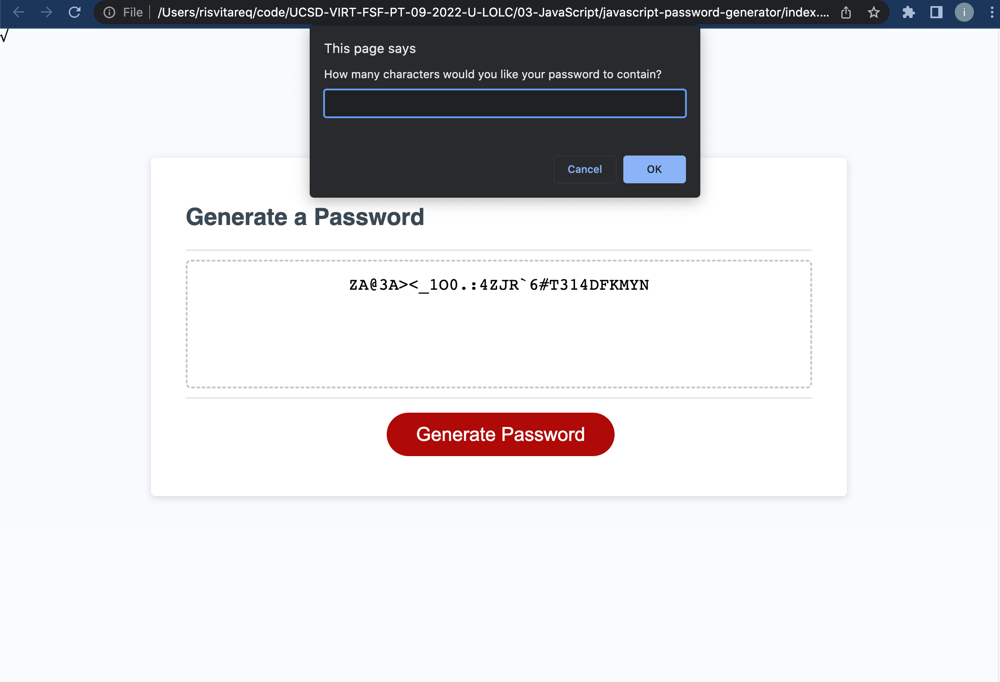

# javascript-password-generator
Module 3 Challenge
## Description
I was given a starter code for a password generator. The starter code contained an html file, a CSS.style file and an incomplete JavaScript file. The password generator requires that the users input a password length between 8 and 128 and gives them four different password characteristics to choose from. The four characteristics that the user can include in their password are numbers, lowercase letters, uppercase letters and special characters. The users can choose whether or not they want to include any of the four criteria. Once the criterias are chosen, the password generates a randomized password that is length the user had specified. If the user does choose any of the four criteria, then a default password that contains only numbers with the length that the user specified.

## Table of Contents
<nav>
    <ol>
        <li><a href="#How to Use this Project">How to Use this Project</a></li>
        <li><a href="#Contributors">Contributors</a></li>
    </ol>
</nav>

## How to Use this Project
<a href="https://ivsir.github.io/javascript-password-generator/">This is the link to my WebPage</a>

## Contributors
Risvi Tareq